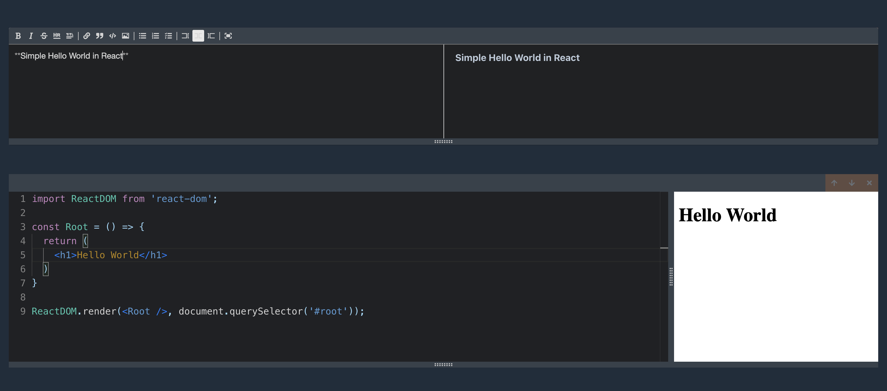

# Jbook: Online JavaScript and Text Editor

This app lets you create many code editors in your browser and see the output as you code, you can import libraries and work with them, for example React, also it lets you create rich text with as many editors as you want.

## Screenshot

## Live Demo

[Live Demo Link](https://torresbribiesca.tech/jbook//)

## Built With 🛠

- React
- Typescript
- Redux
- Fontawesome

## Author

### 👨‍💻 Jorge Torres

- Github: [Jorge Torres](https://github.com/Yors-git)
- Linkedin: [Jorge Torres](https://www.linkedin.com/in/jtbribiesca/?locale=en_US)
- Twitter: [@Yors_82](https://twitter.com/Yors_82)

### 🤝 Contributing

Contributions, issues and feature requests are welcome!

### Show your support

Give a ⭐️ if you like this project!

### License

This project belongs to Jorge Torres, all rights reserved.
